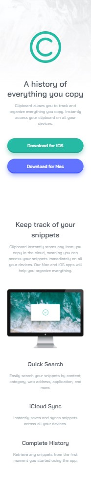
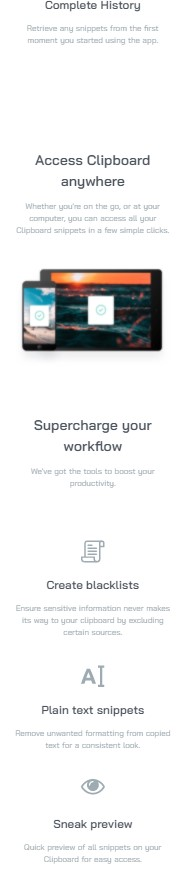
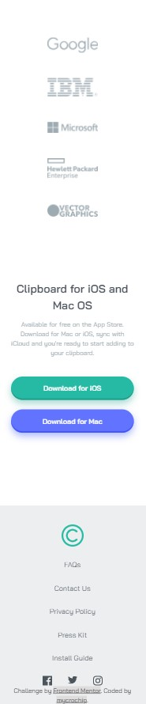
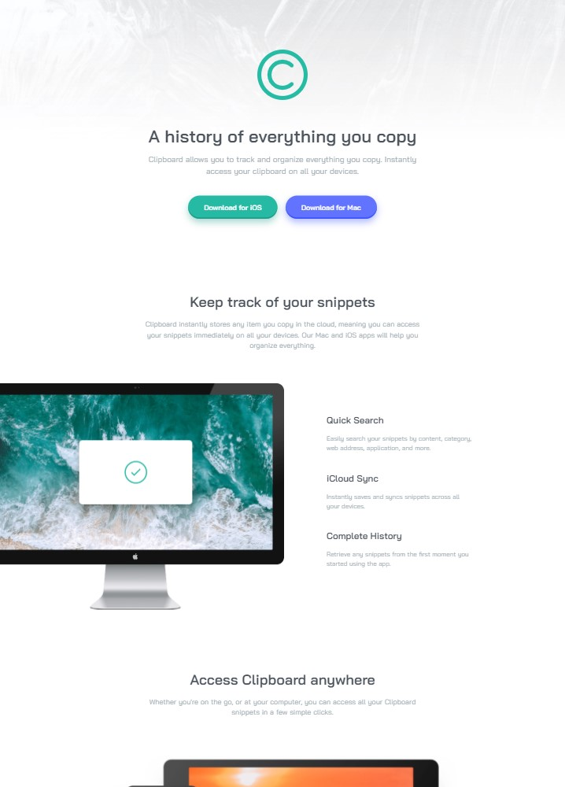
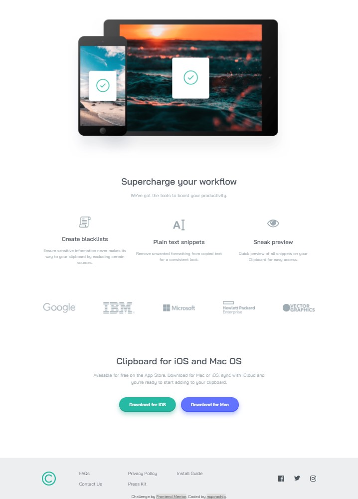

# Frontend Mentor - Clipboard landing page solution

This is a solution to the [Clipboard landing page challenge on Frontend Mentor](https://www.frontendmentor.io/challenges/clipboard-landing-page-5cc9bccd6c4c91111378ecb9). Frontend Mentor challenges help you improve your coding skills by building realistic projects. 

## Table of contents

- [Overview](#overview)
  - [The challenge](#the-challenge)
  - [Screenshot](#screenshot)
  - [Links](#links)
- [My process](#my-process)
  - [Built with](#built-with)
  - [What I learned](#what-i-learned)
  - [Continued development](#continued-development)
- [Author](#author)

## Overview

### The challenge

Users should be able to:

- View the optimal layout for the site depending on their device's screen size
- See hover states for all interactive elements on the page

### Screenshot
- Mobile view - 375px
  

- Desktop view - 1440px
 

### Links

- Solution URL: [https://github.com/mycrochip/3-column-preview-card-component.git](https://github.com/mycrochip/clipboard-landing-page.git)
- Live Site URL: [https://mycrochip.github.io/3-column-preview-card-component/](https://mycrochip.github.io/clipboard-landing-page/)

## My process

### Built with

- Semantic HTML5 markup
- CSS custom properties
- Flexbox
- CSS Grid
- Mobile-first workflow

### What I learned

This is the first website I will build with a height more than 100vh (Standard viewport height).
I really worked hard to make sure that the content rendered in screen views were relevant and the components on the page were displayed in a reasonable position relative to the screen.

### Continued development

I will continue to sharpen my HTML and CSS skils before touching a line of JavaScript. This is the pah I believe will make me most efficient in mastering front-end development.
By the way, time to take on more challenges on [Frontend Mentor](https://www.frontendmentor.io)

## Author

- Frontend Mentor - [@mycrochip](https://www.frontendmentor.io/profile/mycrochip)
- Twitter - [@mycrochip_world](https://www.twitter.com/mycrochio_world)
